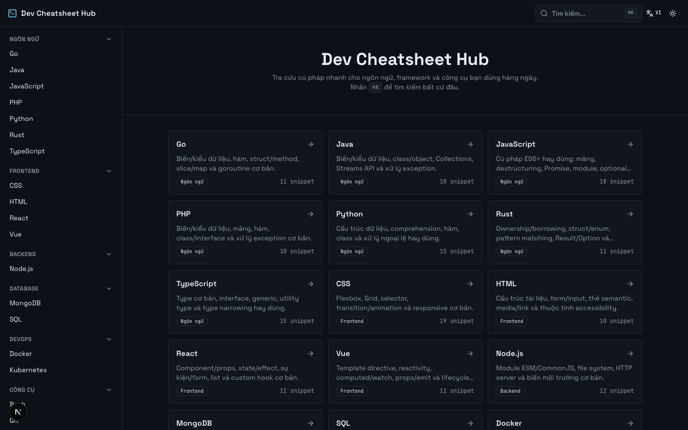
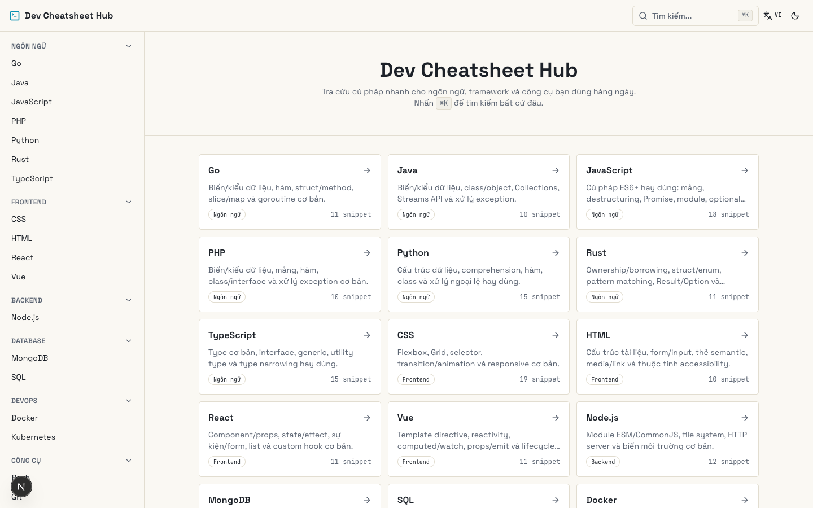
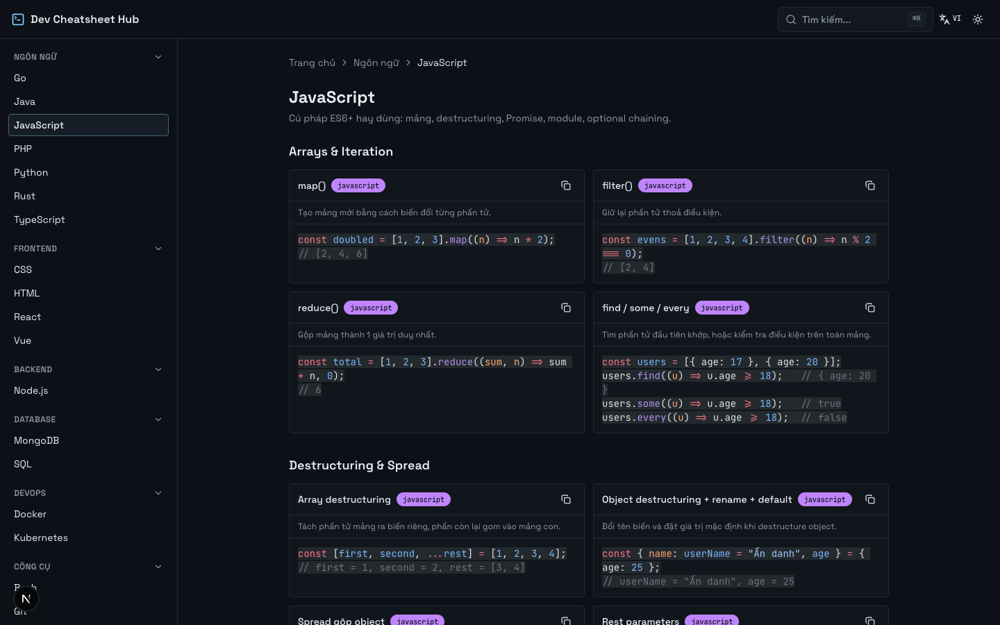

# Dev Cheatsheet Hub

Cheat sheet lập trình tra cứu nhanh, giao diện lấy cảm hứng từ code editor — dark mode mặc định, hỗ trợ song ngữ Việt/Anh và tìm kiếm tức thì qua command palette.

## Screenshots

| Dark mode | Light mode |
|---|---|
|  |  |

**Trang chi tiết cheat sheet:**



## Tính năng

- **20 cheat sheet**: JavaScript, TypeScript, Python, Go, Rust, Java, PHP, HTML, CSS, React, Vue, Node.js, SQL, MongoDB, Docker, Kubernetes, Bash, Git, Markdown, Regex
- **Song ngữ Việt/Anh** — chuyển ngôn ngữ tức thì tại header, ghi nhớ lựa chọn giữa các phiên
- **Dark/Light theme** — mặc định tối, không có hiệu ứng flash khi tải trang
- **Command palette (⌘K / Ctrl+K)** — tìm nhanh theo tên snippet, cheat sheet hoặc mô tả
- **Copy code 1 chạm**, syntax highlighting cho từng snippet
- **Điều hướng theo danh mục**: Ngôn ngữ, Frontend, Backend, Database, DevOps, Công cụ
- Site tĩnh (SSG), không phụ thuộc backend hay database

## Tech stack

| Layer | Công nghệ |
|---|---|
| Framework | [Next.js 16](https://nextjs.org) (App Router, Turbopack) |
| Ngôn ngữ | [TypeScript](https://www.typescriptlang.org) |
| Styling | [Tailwind CSS v4](https://tailwindcss.com) |
| UI components | [shadcn/ui](https://ui.shadcn.com) ([Base UI](https://base-ui.com)) |
| Validation | [Zod](https://zod.dev) |
| Syntax highlight | [Shiki](https://shiki.style) |
| Command palette | [cmdk](https://cmdk.paco.me) |
| Testing | [Vitest](https://vitest.dev) + Testing Library |

## Bắt đầu

```bash
npm install
npm run dev
```

Mở [http://localhost:3000](http://localhost:3000) để xem kết quả.

### Scripts

| Lệnh | Mô tả |
|---|---|
| `npm run dev` | Chạy dev server |
| `npm run build` | Build production |
| `npm run start` | Chạy bản đã build |
| `npm run lint` | Kiểm tra lint |
| `npm test` | Chạy test suite |

## Cấu trúc dự án

```
app/                     Next.js App Router — route và layout
components/              UI components (layout, home, cheatsheet, ui/)
content/
  schema.ts              Zod schema cho cheat sheet (song ngữ { vi, en })
  categories.ts          Danh mục cố định
  cheatsheets/*.ts       Nội dung từng cheat sheet
  registry.ts            Loader: validate + truy vấn nội dung
lib/
  i18n.ts                Dictionary UI song ngữ
  search.ts              Logic lọc cho command palette
  highlight.ts           Wrapper cho syntax highlighting
```

## Thêm cheat sheet mới

1. Tạo file trong `content/cheatsheets/`, export một object khớp `Cheatsheet` schema (`content/schema.ts`) — `title`/`description` của section và snippet ở dạng `{ vi, en }`.
2. Import và thêm vào mảng `RAW_CHEATSHEETS` trong `content/registry.ts`.
3. Thêm danh mục mới (nếu cần) trong `content/categories.ts`.

Trang chủ, sidebar và command palette tự động nhận nội dung mới mà không cần sửa code UI.

## License

MIT
